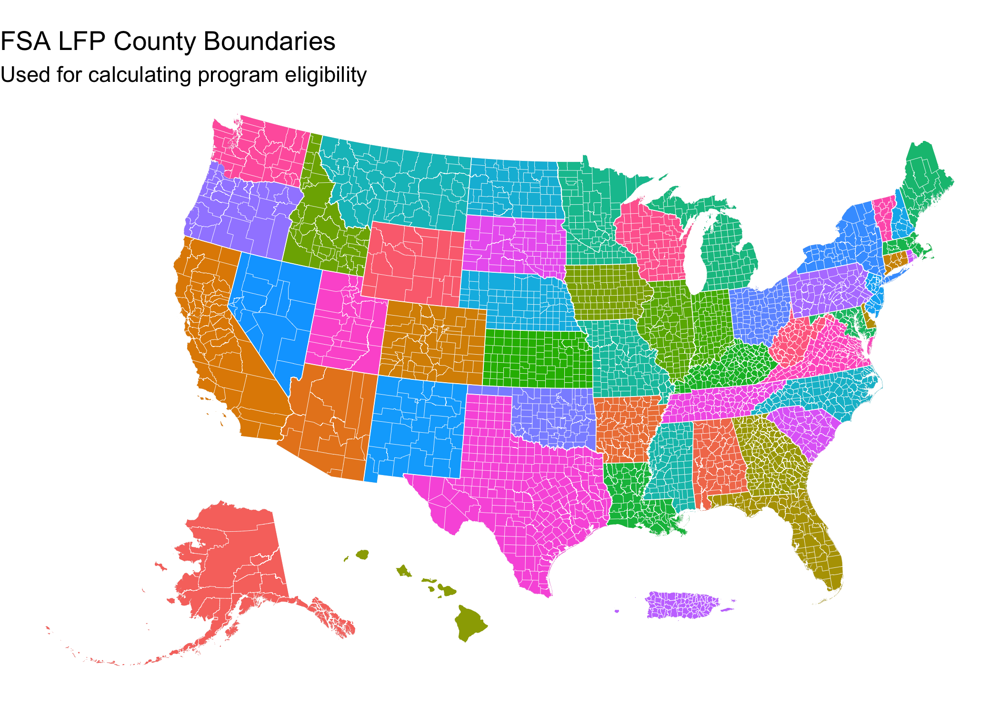

[](https://github.com/sustainable-fsa/fsa-lfp-counties)
[](https://zenodo.org/badge/latestdoi/1050800186)

This repository is an archive of the county boundary dataset used to
determine USDA [Livestock Forage Disaster Program
(LFP)](https://www.fsa.usda.gov/resources/programs/livestock-forage-disaster-program-lfp)
eligibility.

Each week, eligibility for the LFP is determined for each county in the
United States. Federal law and FSA guidance describes a process by which
[county-level
eligibility](https://sustainable-fsa.github.io/fsa-lfp-eligibility/) is
determined by the intersection of county boundaries, the [United States
Drought Monitor weekly drought
assessment](https://sustainable-fsa.github.io/usdm/), and the [normal
grazing
period](https://sustainable-fsa.github.io/fsa-normal-grazing-period/)
for each type of grazing land in each county.

[Official county boundaries
change](https://www.census.gov/programs-surveys/geography/technical-documentation/county-changes.html),
both substantially as counties and county equivalents are created and
removed as well as in small ways as legal boundaries between counties
are refined. For instance, the US Census has recorded 472 county
boundary corrections or changes from 2008 through 2024. Thus, agencies
that make regulatory actions which implicate county boundaries (such as
LFP eligibility determination) *must* maintain records of which
boundaries were used for such determinations. LFP eligibility
determinations stipulate that if “any area of the county” falls within
certain drought classes during a type of crop’s normal grazing period
eligibility is triggered. County boundary definitions are essential to
the administration of the LFP.

> For more information on determining eligibility for the LFP, refer to
> [FSA Guidance document 1-LFP Amendment 6, Paragraph
> 23A](https://www.fsa.usda.gov/Internet/FSA_File/1lfp-a6.pdf).

The data in this repository were acquired via FOIA request
**2025-FSA-08431-F** by R. Kyle Bocinsky (Montana Climate Office) and
fulfilled on September 8, 2025. The FOIA response, including the
original Esri file geodatabase, is archived in the [`foia`](./foia)
directory.

## FOIA Final Response

During the process of refining the FOIA request, the FSA LFP Program
Owner revealed that the geospatial county eligibility determination is
not performed by USDA staff, but instead is performed by the National
Drought Mitigation Center under contract to the USDA Office of the Chief
Economist. The “Program Owner” for an FSA program is a senior official
or department within the agency responsible for a specific farm or loan
program. On August 11, 2025, seeking clarification about the request,
the Program Owner said:

> FSA does not use a county boundary to determine LFP eligibility. FSA
> and the USDM use a tabular file of counties, states, and grazing
> periods established for specific pasture types in conjunction with
> *drought data received from the USDM by physical state and county*, no
> boundary files are used. \[Emphasis added\]

Accordingly, Bocinsky requested that the Program Owner contact the USDM
and request the geospatial county boundary data used for the county
drought determinations, including how those data have changed through
time and any computer scripts or protocols used when making that
determination.

In the FOIA Final Response, received on September 8, 2025, the Program
Owner provided a geospatial counties dataset from the National Drought
Mitigation Center, who produces the USDM. The FOIA response also
provided the following explanation:

> In response to your request, we compiled and are releasing in full,
> the National Drought Mitigation Center (NDMC)s geodatabase that
> contains the current county boundaries. According to the program
> owner, the boundaries are from the ESRI dataset from 2008 and are
> considered the industry standard for all geopolitical boundaries and
> reference layers. The NDMC obtained these layers prior to the 2008
> Farm Bill first that included relief programs associated with the USDM
> as county level statistics and maps were available when the transition
> to GIS map development took place. The NDMC uses this data to have a
> consistent value for the various counties that have not changed since
> they were first incorporated in 2008. The NDMC has had to update some
> counties during this time due to changes made in redrawing and/or
> renaming counties and with new FIPS creations. The last such change
> being in 2021 that included an Alaska boundary change. This was a
> relatively simple change as Alaska doesn’t touch any other states with
> the updates not affecting the rest of the United States. The other
> most recent change was in 2019 that included a county name and FIPS
> change in South Dakota and that did not require a geometry change. The
> next anticipated changes that will be required are in Connecticut due
> to a redraw and renaming of their county level jurisdictions that were
> initiated at the state level. This change will be made within the
> existing detailed boundaries and shapefiles of these new jurisdiction
> units. We will be redrawing the internal boundaries based on the best
> available data, either from the U.S. Census, the state of Connecticut,
> or commercial (ESRI) sources and the NDMC will need to work directly
> with USDA to determine exactly how these will be implemented with
> regards to programs triggered by the USDM. This process has been our
> standard for updating changing geometry in base datasets that are used
> in the weekly calculations. All the data utilized in the weekly
> calculations are freely available on the United States Drought Monitor
> website under the “data” tab:
> <https://droughtmonitor.unl.edu/Data.aspx>. The final data are updated
> each week during the official release of the USDM map and associated
> statistics and data information. These data are also the same data
> utilized in the making of the North American Drought Monitor. The NDMC
> is the official home and archive of all the data, maps, and
> information related to the United States Drought Monitor, and all this
> information is freely available at <https://droughtmonitor.unl.edu/>.

Given the pronouns used in this narrative, it was most likely written by
NDMC staff.

### Considerations

A few considerations should be noted:

1.  The Program Owner states, “the boundaries are from the ESRI dataset
    from 2008 and are considered the industry standard for all
    geopolitical boundaries and reference layers.” Esri is the company
    that makes the ArcGIS software platform used by the NDMC for
    geospatial processing and analysis. There is no single dataset that
    would be considered an Esri counties dataset; rather, this likely
    refers to a county boundary data that Esri provided prior to 2008.
    While Esri software and the ArcGIS platform could arguably be called
    the “industry standard”, the counties dataset to which the Program
    Owner is referring is of unknown origin and provenance.

2.  Furthermore, “industry standard” does not necessarily mean “federal
    standard”. The county boundaries in this dataset differ
    substantially from those of the US Census county boundary dataset,
    the authoritative county boundaries of the United States.

3.  The intersection of counties and USDM drought class polygons happens
    on a weekly basis. In their response, Program Owner acknowledges
    that the counties dataset used by the NDMC for this process have
    been updated since 2008, but there is only one file provided (the
    “current county boundaries”). It is unclear whether archives of past
    versions of the FSA LFP county dataset exist.

## 🗂️ Contents

- [`foia/2025-FSA-08431-F Bocinsky.zip`](./foia/2025-FSA-08431-F%20Bocinsky.zip)
  — original FOIA data and correspondence
- [`fsa-lfp-counties.R`](./fsa-normal-grazing-period.R) — archive
  processing script
- [`fsa-lfp-counties.parquet`](./fsa-lfp-counties.parquet) — FSA LFP
  county data in GeoParquet format
- [`fsa-lfp-counties.xml`](./fsa-lfp-counties.xml) — ArcGIS metadata for
  the FSA LFP county data
- [`fsa-lfp-counties-usdm_data.py`](./fsa-lfp-counties-usdm_data.py) —
  Python functions for processing and clipping USDM shapes to the
  counties dataset
- [`fsa-lfp-counties-usdm_tabulatestats.py`](./fsa-lfp-counties-usdm_tabulatestats.py)
  — Python functions for calculating zonal statistics for counties and
  other geometries

------------------------------------------------------------------------

## Data Processing

The 2025-09-04 FOIA response contains two zipped archives: one
containing an Esri file geodatabase with the county definitions, and one
containing two python scripts of code for processing and clipping USDM
shapes to the counties dataset and calculating zonal statistics. The
processing script [`fsa-lfp-counties.R`](./%60fsa-lfp-counties.R):

1.  **Unzips** the zipped archive.
2.  **Reads** the Esri file geodatabase into a spatial object in R using
    the `sf` package.
3.  **Writes** the spatial counties data to `fsa-lfp-counties.parquet`
    in Brotli-compressed Apache Parquet format.
4.  **Extracts** Esri metadata from the file geodatabase, and writes it
    in XML format as `fsa-lfp-counties.xml`.
5.  **Copies and renames** the USDM processing scripts to the base
    directory.
6.  **Renders** this document into `README.md`.

### Data Description

The data are in the NAD 1983 Albers contiguous USA coordinate reference
system ([ESRI:102003](https://spatialreference.org/ref/esri/102003/)),
though metadata suggest that CRS has been transformed from what was
originally a geographic reference system (most likely [WGS 84
EPSG:4326](https://spatialreference.org/ref/epsg/4326/)). The dataset
contains several columns that are derived via Visual Basic or Python
processing scripts, as well as geographic statistics (length and area).
These columns are not well documented, but can be inferred from the
data.

| Variable Name  | Description                                                                      |
|----------------|----------------------------------------------------------------------------------|
| `ISCONUS`      | Whether the county is part of the Continental United States                      |
| `ISTOTAL`      | Whether the county is an outlying territory of the US                            |
| `StateFIPS`    | A two-digit FIPS state code                                                      |
| `WKID`         | The Well-Known ID for a spatial reference system (SRS) — presumably the original |
| `CountyName`   | The county name                                                                  |
| `CountyFIPS`   | A five-digit FIPS state and county code                                          |
| `StateAbbr`    | The state abbreviation                                                           |
| `ShowCounty`   | A boolean field presumably related to internal USDM mapping                      |
| `Shape_Length` | The boundary length of the county, in meters                                     |
| `Shape_Area`   | The area of the county, in square meters                                         |

------------------------------------------------------------------------

## 📍 Quick Start: Visualize the FSA LFP Counties data in R

This snippet shows how to load the `fsa-lfp-counties.parquet` file from
the archive and create a simple map using `sf` and `ggplot2`.

``` r
# Load required libraries
library(sf)
library(ggplot2) # For plotting
library(rmapshaper) # For innerlines function

## Load the fsa-lfp-counties parquet file
counties <- 
  # You can read straight from online
  # sf::read_sf("https://sustainable-fsa.github.io/fsa-lfp-counties/fsa-lfp-counties.parquet") %>%
  sf::read_sf("fsa-lfp-counties.parquet") %>%
  # transform to WGS 84
  sf::st_transform("EPSG:4326") %>%
  # Shift and rescale AK, HI, and PR
  tigris::shift_geometry()

# Plot the map
ggplot(counties) +
  geom_sf(data = sf::st_union(counties),
          fill = "grey80",
          color = NA) +
  geom_sf(data = counties,
          aes(fill = StateAbbr), 
          color = NA,
          show.legend = FALSE) +
  geom_sf(data = rmapshaper::ms_innerlines(counties),
          fill = NA,
          color = "white",
          linewidth = 0.1) +
  geom_sf(data = counties |>
            dplyr::group_by(StateAbbr) |>
            dplyr::summarise() |>
            rmapshaper::ms_innerlines(),
          fill = NA,
          color = "white",
          linewidth = 0.2) +
  labs(title = "FSA LFP County Boundaries",
       subtitle = "Used for calculating program eligibility") +
  theme_void()
```



------------------------------------------------------------------------

## 📜 Citation

If using this data in published work, please cite:

> USDA Farm Service Agency. *Livestock Forage Disaster Program County
> Boundaries*. FOIA request 2025-FSA-08431-F by R. Kyle Bocinsky.
> Accessed via GitHub archive, YYYY.
> <https://sustainable-fsa.github.io/fsa-lfp-counties/>

------------------------------------------------------------------------

## 📄 License

- **Raw FOIA data** (USDA): Public Domain (17 USC § 105)
- **Processed data & scripts**: © R. Kyle Bocinsky, released under
  [CC0](https://creativecommons.org/publicdomain/zero/1.0/) and [MIT
  License](./LICENSE) as applicable

------------------------------------------------------------------------

## ⚠️ Disclaimer

This dataset is archived for research and educational use only. It may
not reflect current USDA administrative boundaries or official LFP
policy. Always consult your **local FSA office** for the latest program
guidance.

To locate your nearest USDA Farm Service Agency office, use the USDA
Service Center Locator:

🔗 [**USDA Service Center
Locator**](https://offices.sc.egov.usda.gov/locator/app)

------------------------------------------------------------------------

## 👏 Acknowledgment

This project is part of:

**[*Enhancing Sustainable Disaster Relief in FSA
Programs*](https://www.ars.usda.gov/research/project/?accnNo=444612)**  
Supported by USDA OCE/OEEP and USDA Climate Hubs  
Prepared by the [Montana Climate Office](https://climate.umt.edu)

------------------------------------------------------------------------

## ✉️ Contact

Questions? Contact Kyle Bocinsky: <kyle.bocinsky@umontana.edu>
